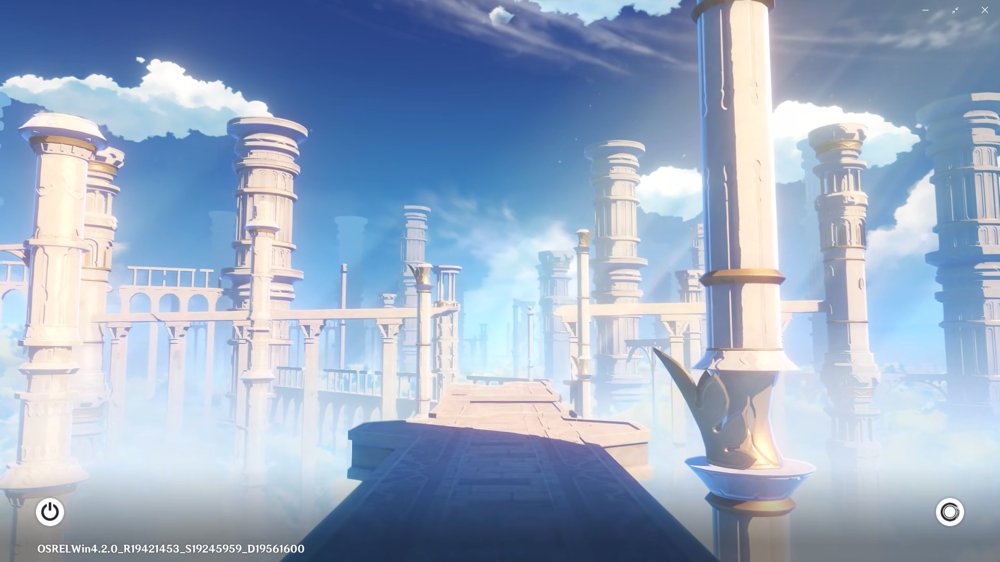

# Genshin-Windows-Login
1:1 Replica of Genshin Impacts Login Screen implemented in Windows Login Screen.Similar to SDDM build but with less functions for now

## Features (50% Completed)

There is no 'theme.conf' file anymore.May add it later.

  
<b>✔️QT6 Framework(2/2)</b>
 (OPTIMIZED)
    
- [x] Change Code for QT6 Deployment
    - [x] Use New TypeNames
    - [x] Use New Attributes
    - [x] Optimize last result
- [x] Create and Deploy Standalone executable
    - [x] Debug App
    - [x] Build App
    - [x] Deploy APp

  
✔️<b>Login Menu (4/4)</b>
 (OPTIMIZED)

- [x] Login Background
- [x] Username Area
    - [x] Replace QML with TextArea
    - [x] Delete Unnecessary and buggy attributes
    - [x] Optimize it even more
- [x] Password Area
    - [x] Replace QML with TextArea
    - [x] Delete Unnecessary and buggy attributes
    - [x] Optimize it even more
- [x] Github and Linkedin Credits

      

<b>❓Date&Time Menu (?/1)</b>

- [ ] Worked un Build but not in Deployment.I will try to fix it

      

   
❓<b>Door Animation (?/5)</b>

- [x] Function to validate Username and Password
- [x] fragmentShader config for Transparent videos
- [x] Door Videos
    - [x] Morning Door
    - [x] Sunlight Door
    - [x] Night Door
- [x] Transparent Videos
    - [x] Morning Door
    - [x] Sunlight Door
    - [x] Night Door
- [x] Encoded Videos

      ❌ Transparent MOV (Didn't work)
      
      ❌ Transparent Webm (Didn't work)
      
      ❌ Custom Function For Png Sequence (Didn't work)
      
      ❌ (fragmentShader config doesn't work anymore)

      ❌ (Baked Shaders for Vulcan Compatibility doesn't work)

      
    - [x] Morning Door
    - [x] Sunlight Door
    - [x] Night Door

    
✔️<b>Loading Animation (1/1)</b>

  
- [x] 1:1 Replica of Genshins Loading animation when you succesfully log in.

    
✔️<b>Varying Animations for different time of the day (3/3)</b>

- [x] Morning Animations
- [x] Sunlight Animations
- [x] Night Animations
  

  
<b>❓Custom songs and Music Player (1/2)</b>

- [x] List of custom songs
- [ ] Music Player on login screen to change the currently playing song(You can't change song at least for now)

 ~~<b>❌ Power Menu (0/?)</b>~~ (Removed for Compatibility.Will be added in future Releases)
      
 ~~<b>❌ Session Menu (0/?)</b>~~ (Removed for Compatibility.Will be added in future Releases)
      

## Issues and Contribution

If you would like to contribute to this repo please do so by creating a PR. I am open to suggestions.

## Dependencies

Standalone build doesn't require any dependancies just download and unzip Genshin-Theme-WinV0.01 and run exe file.Library tools for Qt Framework Are like this

- Qt 6.6.1 with MSVC 2019 64-bit
- MinGw 11.2.0 64-bit
- Sources
- QtQuick3D
- Qt5CompatibilityModule
- QtShaderTools
- Additional Libraries
  - QtApplicationManager
  - QtImageFormats
  - QtMultimedia
  - QtQuickEffectsMaker
  - QtStateMachines
- Developer and Designer Tools
  - QtCreator 12.0.1
  - CDBDebuggerSupport
  - DebuggingToolsForWindows
  - MinGw11.2.0 64-bit
  - MinGw8.1.0 32-bit
  - MinGw8.1.0 64-bit
  - Cmake3.27.7
  - Ninja1.10.2

## Installation

1. Download the latest release from the [Genshin Theme for Windows Lock Screen repository](https://github.com/yourusername/yourrepository/releases).
2. Unzip the downloaded file to your desired location.
3. Run standalone executable. (Note that you can't change username and password in standalone release and default username and password is genshin:genshin123)

## Building the Project

To build the project and customize it according to your needs, follow these steps:

1. Download and unzip the project repository.
2. Download the 'nightbg' and 'morningbg' assets from [Google Drive](https://drive.google.com/drive/folders/yourdriveid](https://drive.google.com/drive/folders/1Yz2GxV8uvZJM16YSbE2yPRMT58H5o0Bs?usp=drive_link)).
3. Add the downloaded assets to the 'backgrounds' folder in your project.
4. Open the project file (.pro) in Qt Creator.
5. Configure project settings, such as Release type and target destination folder.
6. Run the application.

**Note:** If you wish to modify the username and password, update the 'credentials.txt' file. Customization options for credentials will be available in future releases.

## Issues and Contributions

If you encounter any issues or would like to contribute to the project, feel free to create a pull request. Your suggestions and contributions are welcome.

## Acknowledgments

Special thanks to the developers and contributors who make this project possible!

## License
